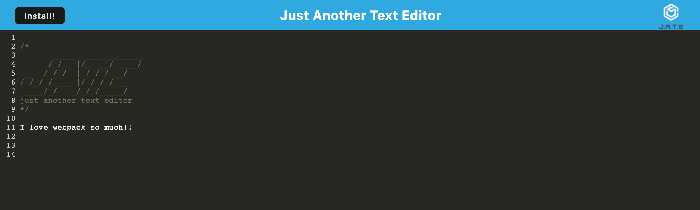

# text-editor-pwa

## Description
This project is a text editor that uses IndexedDB to store, retrieve, and update data. The application is also an installable PWA!

## Table of Contents
- [Installation](#installation)
- [Usage](#usage)
- [Credits](#credits)
- [License](#license)
- [Questions](#questions)

## Installation
To install, git clone the repo, npm i at the root, then run npm run start:dev

## Usage 

[Link to deployed app 🚀](https://pacific-citadel-98307.herokuapp.com/)

## Credits
Anthony Cedrone, Eric Kim, Justin Pauldo, and Leif Hetland for general debugging and help with the process.

UPenn bootcamp for starter code

## License
[MIT License](https://choosealicense.com/licenses/mit) 
This project uses the MIT license
    

## Questions
[Contact me on Github](https://github.com/hope428) 
[Email me at lvforsythe95@gmail.com](mailto:lvforsythe95@gmail.com)

